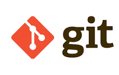

# Olá, eu sou o Claudio Murilo! 👋

### 🔙 Desenvolvedor Back-End em Formação | Alura Estudante

Sou apaixonado por resolver problemas através da lógica e construção de sistemas robustos. Atualmente, focado no ecossistema Back-End.

---

### 🛠️ Tecnologias e Ferramentas:

  
  
  
  

---

### 🎓 Formação em Programação (Alura)

| Categoria | Curso | Status |
| :--- | :--- | :---: |
| **Lógica** | Lógica de Programação: mergulhe em JavaScript | ✅ Concluído |
| **Lógica** | JavaScript: explorando a linguagem | ✅ Concluído |
| **Back-End** | JavaScript: métodos de array | ✅ Concluído |
| **Back-End** | JavaScript: consumindo e tratando dados de uma API | ✅ Concluído |
| **Infra** | Git e GitHub: repositório, commit e push | ✅ Concluído |

---

### 📫 Vamos nos conectar?

